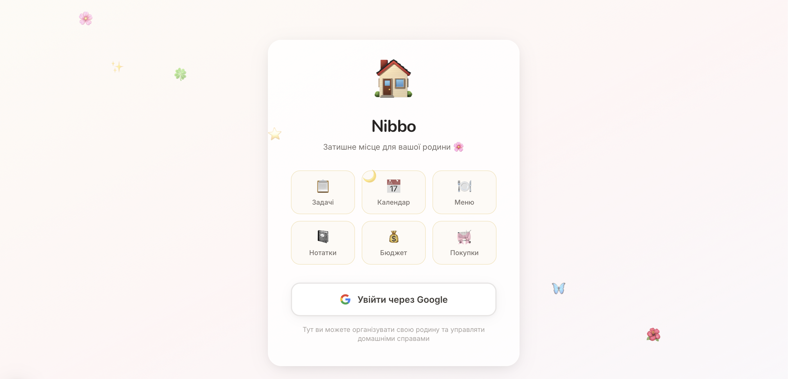

# Nibbo

Nibbo is a family home CRM built with Next.js.  
It combines shared planning tools (tasks, calendar, menu, notes, shopping, budget) with a 3D pet that grows as you complete tasks.



## Main Features

- Google sign-in
- Family spaces with member management and invite flow
- Task boards with drag-and-drop
- Calendar, menu planner, notes, shopping list, budget
- Points system for completed tasks
- 3D Nibbo companion (`/dashboard`)
- Private file access scoped to family members

## Stack

- Next.js (App Router) + TypeScript
- Prisma + PostgreSQL (Neon-ready)
- NextAuth
- Local file uploads (`uploads/` or `UPLOAD_DIR`)
- Tailwind CSS

## Local Run

```bash
npm install
npm run db:generate
npm run db:push
npm run dev
```

Create `.env` based on `.env.example` and set:

- `DATABASE_URL`
- `DIRECT_URL`
- `AUTH_SECRET`
- `AUTH_URL`
- `GOOGLE_CLIENT_ID`
- `GOOGLE_CLIENT_SECRET`
- `UPLOAD_DIR` (optional; defaults to `./uploads` under the app root)