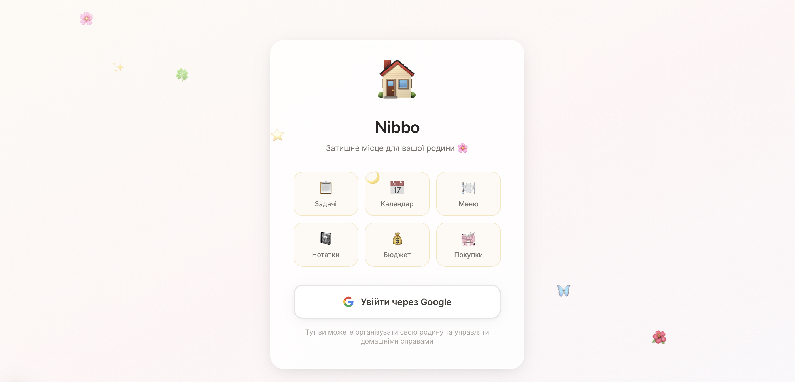

# Nibbo

Nibbo is a family home CRM built with Next.js.  
It combines shared planning tools (tasks, calendar, menu, notes, shopping, budget) with a 3D pet that grows as you complete tasks.



## Main Features

- Google sign-in
- Family spaces with member management and invite flow
- Task boards with drag-and-drop
- Calendar, menu planner, notes, shopping list, budget
- Points system for completed tasks
- 3D Nibbo companion (`/dashboard`)
- Private file access scoped to family members

## Stack

- Next.js (App Router) + TypeScript
- Prisma + PostgreSQL (Neon-ready)
- NextAuth
- Local file uploads (`uploads/` or `UPLOAD_DIR`)
- Tailwind CSS

## Local Run

```bash
npm install
npm run db:generate
npm run db:push
npm run dev
```

Create `.env` based on `.env.example` and set:

- `DATABASE_URL`
- `DIRECT_URL`
- `AUTH_SECRET`
- `AUTH_URL`
- `GOOGLE_CLIENT_ID`
- `GOOGLE_CLIENT_SECRET`
- `UPLOAD_DIR` (optional; defaults to `./uploads` under the app root)
- `CRON_SECRET` (optional; only for HTTP `/api/cron/bank-sync` — prefer `npm run bank-sync:worker`)

## Monobank sync

Family owners can connect a Monobank personal API token under **Family → Banks**.  
Imported expenses/incomes land in the shared budget; category mapping uses MCC + learned overrides when you edit a Mono expense category.

Run a long-lived worker next to the app (pm2 / systemd / docker):

```bash
npm run bank-sync:worker
```

It loads due Monobank connections about once an hour (`BANK_SYNC_INTERVAL_MS`, override with `BANK_SYNC_WORKER_INTERVAL_MS`). Needs the same `DATABASE_URL` and `AUTH_SECRET` as the app (token decrypt).

Example pm2:

```bash
pm2 start "npm run bank-sync:worker" --name nibbo-bank-sync
```

Optional HTTP fallback (crontab calling the API):

```cron
0 * * * * curl -fsS -X POST -H "Authorization: Bearer $CRON_SECRET" https://your-host/api/cron/bank-sync
```